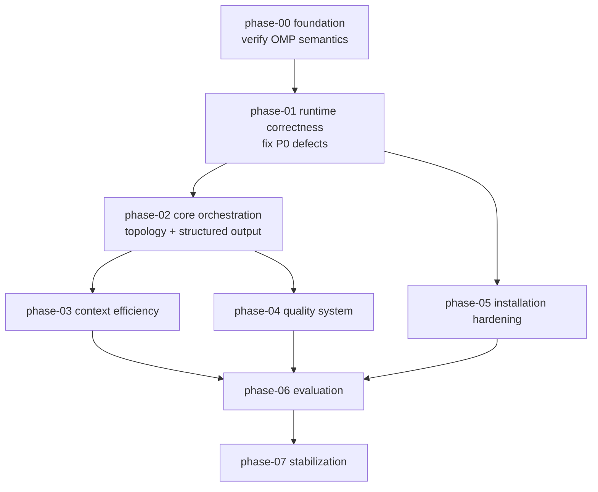

# OPUS PROPOSED SPEC v1 — omp-custom Architecture Review

> **Status: AWAITING JOINT SPEC REVIEW — NOT FINAL**
> Independent analysis by Claude Opus 5, verified against OMP source at
> `_research/upstreams/oh-my-pi` (packages/coding-agent). Subject to ChatGPT counter-review.

---

## 1. Executive Summary

`omp-custom` is a Workflow v0 template for OMP that establishes a Tech Lead →
Explorer → Implementer → Verifier → Reviewer pattern over OMP-native primitives.

**The verdict: the intent is sound, the abstractions are ~60% correct, and the
runtime wiring is broken in ways static validation cannot see.**

The single most important finding is not any individual bug. It is a **category
error**: the template invented two folders (`.omp/policies/`, `.omp/schemas/`) and
two reference syntaxes (`policy:*`, `schema: \`name\``) that **do not exist in OMP**.
I grepped every discovery provider in OMP source. `commands/`, `skills/`, `agents/`,
`rules/`, `prompts/`, `hooks/`, `tools/`, `instructions/`, `extensions/` are
discovered. `policies/` and `schemas/` have **zero** discovery hooks. They are inert
files. Nine YAML documents totalling ~1,100 lines have no runtime consumer.

Meanwhile OMP **does** offer the exact primitive the template wanted: an `output:`
key in agent frontmatter, parsed into `ParsedAgentFields.output` and threaded to the
`yield` tool as an enforced schema with retry-on-mismatch. **None of the five agent
files use it.** The template hand-rolled a documentation convention where a native
enforcement mechanism was already available.

The second most important finding: `validate-template.ps1` asserts
`template\.omp\commands\quick.md` exists, while `install-template.ps1` maps its
`"workflows"` component to a `workflows/` folder that does not exist. **Validation
passes 63/63 and the installer silently installs zero command files.** This is the
clearest possible demonstration that the current 63/63 score measures file presence,
not correctness.

**Correction to my own first-pass reading:** I initially recorded that
`tech-lead.md` and `verifier.md` lacked `---` frontmatter fences. That was a
WebFetch HTML-rendering artifact. Byte-level inspection (`sed -n '1,8p' | cat -A`)
confirms **all five agent files have correct `---` fences**. That finding is
withdrawn. Similarly, `thinking-level:` and `read-summarize:` are **valid** — OMP's
`parseFrontmatter` runs `normalizeKeys`, which converts kebab-case to camelCase
before field parsing. Several items ChatGPT and I both flagged as "unverified
frontmatter" are in fact correct.

Worth preserving: the coding constitution in `AGENTS.md`, the four result contracts
(as *content*), the workflow-sizing decision signals, the context-budget policy's
numeric targets, and the false-positive-control discipline in `reviewer.md`. These
are genuinely good and mostly need re-homing, not rewriting.

---

## 2. Current System Maturity

| Dimension | Status | Evidence |
|---|---|---|
| Command discovery | ✅ Correct | `.omp/commands/*.md` → `discovery/builtin.ts:345` |
| Skill discovery | ✅ Correct | `.omp/skills/<name>/SKILL.md` → `discovery/builtin.ts:287` |
| Agent discovery | ✅ Correct | `.omp/agents/*.md` → `task/discovery.ts:80` |
| Agent frontmatter | ⚠️ Valid but incomplete | `name`/`description`/`tools`/`model`/`spawns`/`thinking-level`/`read-summarize` all parse; **`output:` unused** |
| `AGENTS.md` / `RULES.md` | ✅ Correct | `builtin.ts:923` / `builtin.ts:398` |
| `config.yml` | ✅ Discovered | `builtin.ts:879` |
| **`policies/`** | ❌ **Not an OMP concept** | Zero discovery hooks in any provider |
| **`schemas/`** | ❌ **Not an OMP concept** | Zero discovery hooks in any provider |
| Structured output enforcement | ❌ None | Native `output:` frontmatter + task `outputSchema` both unused |
| Agent topology | ⚠️ Ambiguous | `tech-lead.md` never spawned by any command |
| LSP wiring | ❌ Contradictory | `explorer.md` body says "use LSP hover, references"; `lsp` absent from its `tools:` |
| Installer | ❌ Broken | `"workflows"` → nonexistent folder; commands never install |
| Installer docs | ❌ Wrong args | README uses `-TargetDir`; script declares `-ProjectDir` |
| Config install | ❌ Clobbers | `Copy-Item -Force`, no merge |
| Benchmark | ❌ Inert | Prints fixture list and instructions; launches no session |
| Validation | ⚠️ Static only | File existence, char/4 token estimate, phrase grep |

---

## 3. Major Confirmed Problems

### P0 — blocks correct operation

1. **Installer never installs commands.** `install-template.ps1` default component
   list contains `"workflows"`, mapped to `template/.omp/workflows/`. The real folder
   is `commands/`. `Test-Path` fails, the loop contributes nothing, no warning is
   emitted. All three workflows are silently missing from every install.

2. **`policies/` and `schemas/` are inert.** Nine YAML files, no OMP consumer. Every
   `policy:workflow-sizing` and `` schema: `agent-result` `` reference in the agent
   prompts is an unresolvable string the model must guess at.

3. **Native structured output is unused.** OMP parses `output:` from agent
   frontmatter into `ParsedAgentFields.output`; `YieldTool` compiles it into a
   validator with up-to-3 retries on mismatch (`tools/yield.ts`,
   `MAX_SCHEMA_RETRIES = 3`). Zero agent files declare `output:`. The four schema
   YAMLs describe exactly what should go there.

4. **Documented install commands fail.** README and `docs/report-design.md` invoke
   `-TargetDir`; the script declares `-Target` + `-ProjectDir`. PowerShell rejects
   unknown named parameters, so the documented happy path errors out. `uninstall`
   docs pass `-TargetDir` while the script requires mandatory `-BackupDir`.

5. **Explorer instructs LSP use without LSP access.** `explorer.md` body: "Use LSP
   hover, references, and grep before reading full files." Its allowlist is
   `read, grep, glob`. `LspTool` is gated on `session.enableLsp` (`lsp/index.ts:1639`)
   **and** tool-allowlist membership. The instruction is unfollowable; the agent will
   either fabricate LSP calls or fall back to grep silently.

### P1 — blocks production use

6. `config.yml` install is `Copy-Item -Force` — destroys any pre-existing project config.
7. `$Force` parameter declared and never used; copies always force.
8. `task.isolation.mode=auto` selects a *backend*, not a *policy*. Per-task `isolated?: boolean` exists in the task schema and no command sets it.
9. `benchmark.ps1` measures nothing — no OMP invocation anywhere in the script.
10. `evidence-before-completion` is a lazily-triggered skill; it encodes a non-negotiable invariant.
11. `escalation.yml` has no reader — not referenced by any agent, command, or script.
12. `agent-result.schema.yml` is self-contradictory: `verification_results` is listed under `optional_fields` while a field rule requires it when `status: completed`.
13. `read-summarize: false` on Explorer and Verifier is valid syntax but works *against* the token goals — it disables OMP's read summarization for the two roles that read most.

---

## 4. Architecture Principles

1. **OMP is the only runtime.** No second orchestrator, scheduler, or worktree manager.
2. **OmniRoute is the only gateway.** All routing passes through it.
3. **Every artifact maps to a verified OMP primitive, or is explicitly labelled
   documentation / build input / dead.** No magic folders.
4. **Main session is the Tech Lead.** Commands carry the orchestration logic.
5. **Schemas live in `output:` frontmatter and task `outputSchema`.** YAML may remain
   as the human-authored source that *generates* those, never as a runtime lookup.
6. **Policy is prose in the prompt that consumes it.** A policy with no reader is dead.
7. **Isolation is explicit per task call.** Never rely on `auto` for correctness.
8. **Optimize tokens per accepted outcome.** Never trade correctness for token count.
9. **A validator that cannot fail on a real defect is worse than no validator** — it
   manufactures false confidence.

---

## 5. Final Proposed Topology

**Chosen: Option A — main session is the Tech Lead.** Full reasoning in `03-agent-topology.md`.

```
User
  │
  ▼
Main OMP session  ── IS the Tech Lead
  ├── AGENTS.md   — coding constitution + role map (persistent)
  ├── RULES.md    — sticky invariants (short)
  ├── config.yml  — modelRoles: tech-lead/explorer/implementer/verifier/reviewer
  │
  ├── /quick         → inline. inspect → implement → verify. 0 subagents.
  ├── /standard      → task: explorer → implementer → verifier → [reviewer if risk]
  └── /orchestrated  → task batch: explorers ∥ → implementers ∥ (isolated) → verifier → reviewer
                                                                             → integration check

Worker agents (.omp/agents/*.md, spawned via `task`):
  ├── explorer.md     tools: read, grep, glob, lsp   output: <exploration schema>   isolated: false
  ├── implementer.md  tools: read, grep, glob, edit, write, bash, lsp
  │                                                   output: <agent-result schema>  isolated: false (Standard) / true (Orchestrated; see §08 §B)
  ├── verifier.md     tools: read, grep, glob, bash   output: <verification schema>  isolated: false
  └── reviewer.md     tools: read, grep, glob, bash, lsp   output: <review schema>     isolated: false

Skills (.omp/skills/<name>/SKILL.md):
  ├── task-triage/              lazy — triggered on ambiguity
  ├── systematic-debugging/     lazy — triggered on debugging
  └── evidence-before-completion/  autoloadSkills on worker agents (see 11-)

REMOVED: .omp/policies/  (→ prose in commands + agent prompts)
REMOVED: .omp/schemas/   (→ output: frontmatter; YAML retained under docs/ as source)
```

`tech-lead.md` is **retained but demoted** — see `03-agent-topology.md` for the
narrow nested-orchestration case where it earns its place, and why it must not be on
the primary path.

---

## 6. Phase Dependency Graph



---

## 7. Critical Path

`phase-00 → phase-01 → phase-02 → phase-06`

Phase-00 is non-negotiably first: it converts my remaining assumptions into
observed behavior. Phase-01 clears the P0 defects. Phase-02 replaces the dead
abstractions with native mechanisms. Phase-06 is where any claim of improvement
first becomes defensible — before it, all quality claims are assertions.

Phase-03/04/05 are parallelizable after phase-02. Phase-05 depends only on phase-01.

---

## 8. What Must NOT Be Implemented Yet

- Persistent memory, autolearn, automatic skill creation
- Always-on advisor; multi-reviewer panels
- Full OpenSpec / Spec Kit CLI
- Repo-map / semantic retrieval (Serena, repomix) — deferred pending evidence
- Second orchestration engine of any kind
- Automatic install into live `~/.omp/agent/` without explicit approval
- Any settings change to the frozen baseline before phase-06 provides evidence

---

## 9. Current Open Questions

Questions OQ-1, OQ-2 and OQ-4 from my first pass are **now resolved by source
reading** and moved into `02-runtime-semantics.md` as verified facts. What remains
genuinely open — requiring live experiment, not more reading:

| # | Question | Why source reading is insufficient | Impact |
|---|---|---|---|
| OQ-1 | Does `output:` frontmatter reliably enforce through OmniRoute's `openai-codex-responses` API? | `tryEnforceStrictSchema` falls back to `strict = false` per-provider; behavior with this specific gateway is empirical | High |
| OQ-2 | Does `task.isolation.mode=auto` on Windows/ProjFS actually isolate, and does `merge: patch` apply cleanly? | `pi-iso` backend selection is runtime/filesystem-dependent | High |
| OQ-3 | What is the real token delta of `read-summarize: false` on Explorer? | Requires measured A/B | Medium |
| OQ-4 | Does `autoloadSkills` inject into subagent context at spawn, and at what token cost? | Parsed field confirmed; injection point and cost need measurement | Medium |
| OQ-5 | Do custom `modelRoles` (tech-lead, explorer, …) resolve when declared in **project** `.omp/config.yml`, or only user-level? | `getModelRoleAlias` accepts any role present in settings; merge order for project config needs verification | High |

---

## 10. Decisions Requiring ChatGPT Review

**CR-25 — Decision Record categorization:** DRs are split into two classes. *Runtime-fact-grounded* decisions are constrained by verified OMP source behavior — the opposite choice would be demonstrably wrong or require OMP changes. *Normative design choices* are well-supported judgment calls where a reasonable counterargument exists and peer review adds real value.

### A. Decisions Informed by Runtime Facts

**CR-25 — Epistemic separation:** Each decision below distinguishes what OMP source *proves* (a runtime fact, source-cited) from what was *chosen* (a normative decision, rationale-justified). Source evidence constrains the design space; it does not by itself determine the correct choice.

---

**DR-2 — Schema enforcement mechanism**

*Source facts:*
- OMP parses `output:` from agent frontmatter into `ParsedAgentFields.output` (`discovery/helpers.ts:289`)
- `YieldTool` compiles this into a validator with up to 3 retries on mismatch (`tools/yield.ts:MAX_SCHEMA_RETRIES=3`)
- Caller task `outputSchema` takes precedence over agent `output:` when present (`task/structured-subagent.ts:176-188`)
- Session-level `outputSchema` is a third source (lowest precedence)

*Design choice (normative):* Use agent `output:` frontmatter as the canonical schema source per agent. Treat caller `outputSchema` as an explicit per-call override only. Keep YAML under `docs/contracts/` as the human-authored generator source, not runtime files.

*Alternative rejected:* Inline `outputSchema` in every task dispatch. Rejected because: duplicates the source of truth, increases maintenance burden, and contradicts the agent-frontmatter-as-contract model.

---

**DR-3 — Fate of `.omp/policies/`**

*Source fact:* Zero discovery hooks for `policies/` in any OMP provider — exhaustive grep of all discovery providers confirms no loader exists.

*Design choice (normative):* Delete the folder; inline each policy as prose into its single consumer.

*Alternative not rejected (legitimate):* Move to `docs/` as human-readable reference without runtime claims. This is valid — the content is valuable. The chosen approach inlines it to (a) prevent `.omp/` placement from implying runtime meaning, and (b) eliminate synchronization risk between YAML and consuming prose. The spec author acknowledges reasonable peers could prefer `docs/` rehoming.

---

**DR-6 — Explorer isolation**

*Source facts:*
- `isolated: true` requires a git repository (`task/isolation-runner.ts: prepareIsolationContext` throws otherwise)
- Isolation materializes a worktree copy — real setup cost on every invocation
- Explorer only reads; it does not write to disk

*Design choice (normative):* No isolation for Explorer. Read-only agents gain nothing from isolation; the git-repo requirement and materialization cost add overhead with zero benefit.

*Alternative not rejected (legitimate):* Isolate Explorer for strict reproducibility. Rejected on cost/benefit grounds, not because source proves it wrong.

---

**DR-7 — LSP in worker allowlists**

*Source facts:*
- `lsp` tool is gated on BOTH `session.enableLsp` (baseline: `true`) AND per-agent `tools:` allowlist membership (`lsp/index.ts:1639`)
- No agent currently lists `lsp` — the session-level permission is inert for all agents
- Explorer's own instructions reference `lsp references` and `lsp hover` — unfollowable with current allowlist

*Design choice (normative):* Add `lsp` to Explorer, Implementer, and Reviewer. Reviewer needs `lsp references` for blast-radius checks (callers of a modified symbol). Verifier is excluded (command runner; symbol nav is outside its contract).

*Alternative not rejected (legitimate):* Disable `task.enableLsp` and remove LSP language from Explorer. Rejected because LSP provides genuine token savings (targeted symbol lookup vs whole-file reads) that the Explorer's symbol-first contract depends on.

### B. Normative Design Choices

These positions are well-reasoned but involve trade-offs where a legitimate counter-position exists. ChatGPT review adds genuine value here.

| # | Decision | Opus Position | Confidence |
|---|---|---|---|
| DR-1 | Tech Lead: main session vs spawned agent | **Main session; main-session model is user-controlled (Option B, CR-06 resolved).** Spawning costs a recursion level, duplicates context, and orphans ownership of the final answer. The template does NOT guarantee `@tech-lead` routing or a fixed thinking level for the main Tech Lead session — those settings belong to the user's launched session. Role-based `model:` and `thinking-level:` frontmatter are deterministic only for spawned worker agents. `AGENTS.md` documents this contract explicitly. | High |
| DR-4 | `evidence-before-completion` delivery | **`autoloadSkills` on worker agents**, not `alwaysApply`, not lazy | Medium |
| DR-5 | `read-summarize: false` on Explorer/Verifier | **Remove from Explorer** (contradicts token goals); **keep on Verifier** (needs exact output bytes) | Medium |
| DR-8 | Keep 5 agents, or collapse Verifier into Implementer? | **Keep separate.** Independence is the entire value; self-verification is the failure mode being defended against | Medium |

---

## 11. Decisions Opus Is Highly Confident About

Each verified by direct source reading, with the file and line recorded in
`00-current-state-audit.md`:

- `policies/` and `schemas/` are not OMP concepts — exhaustive grep of all discovery providers
- Installer never installs commands — `"workflows"` alias vs `commands/` folder
- README/docs install args do not match script parameters — `-TargetDir` vs `-ProjectDir`
- `output:` frontmatter is the native schema mechanism and is unused — `discovery/helpers.ts:289`, `tools/yield.ts`
- Explorer's LSP instruction is unfollowable — allowlist vs `lsp/index.ts:1639`
- `benchmark.ps1` executes no sessions — whole-script read
- `$Force` is dead — whole-script read
- `task.enableLsp` default is `false`; baseline overrides to `true` — `settings-schema.ts:4617`
- `task.isolation.mode` default is `none`; `auto` names a *backend* — `settings-schema.ts:4463`
- All five agent files have valid `---` fences and valid kebab-case keys — byte inspection + `normalizeKeys`

---

## 12. Decisions Opus Wants ChatGPT to Challenge

1. **DR-1 (topology).** I argue main-session-as-Tech-Lead. The strongest counter is
   that a spawned Tech Lead keeps the user-facing session context small on very long
   tasks. I think that trade is wrong — it moves final-answer ownership into a child
   whose result the parent must then re-summarize — but the context-growth concern is
   real and I want it pressure-tested.

2. **DR-3 (delete `policies/`).** ChatGPT may argue the YAML is valuable as
   human-readable documentation even without a runtime consumer. I agree the *content*
   is valuable and disagree that it should live in `.omp/`, where its presence implies
   runtime meaning it does not have. Challenge whether `docs/` re-homing loses anything.

3. **DR-4 (`autoloadSkills` vs `alwaysApply`).** This depends on OQ-4's measured cost.
   If injection is expensive, lazy triggering plus a one-line `RULES.md` invariant may
   dominate. I hold this at Medium confidence deliberately.

4. **My disagreement with ChatGPT's audit on items 11–12, 17.** ChatGPT flagged
   Explorer/Implementer "missing LSP" and "RULES too restrictive." On LSP I now find
   ChatGPT **more right than my own first pass** — I initially marked it NOT CONFIRMED
   and was wrong; the contradiction is real. On RULES.md I find ChatGPT **wrong** — the
   eight invariants are objective-risk constraints, not autonomy constraints, and
   should stay. I want ChatGPT to defend or withdraw item 17.

5. **Whether phase-00 is over-cautious.** I front-load an experiment phase before any
   fix. An argument exists that the P0 installer bugs are so clear-cut they should be
   fixed first. I chose evidence-first because three of my own first-pass findings were
   wrong; challenge whether that generalizes.

---

## 13. Expected Final Architecture After All Phases

- Every artifact maps to a source-verified OMP primitive, or lives outside `.omp/`
- Structured output enforced natively via `output:` frontmatter, validated at yield
- Policy content inlined into its consumers; `policies/` and `schemas/` gone from `.omp/`
- Explicit per-task isolation; implementers isolated, readers not
- Logical model roles throughout; no hardcoded model IDs in agents or commands
- Installer with real merge, dry-run, diff, backup, manifest, idempotency, rollback
- Validation in five separable tiers; a single number can no longer imply all five
- Evaluation ladder L0–L3 operational, L4 A/B token-quality measurable
- Governance registry with pinned commits, watched paths, adoption ledger

---

## 14. Definition of "Production Ready"

1. All P0 and P1 findings in `00-current-state-audit.md` resolved or explicitly waived with rationale.
2. OQ-1…OQ-5 answered by recorded experiment, not inference.
3. Each of the three workflows executes end-to-end with no silent no-ops.
4. Structured output demonstrably enforced: a deliberately malformed worker result is rejected and retried.
5. Installer: dry-run, diff, backup, manifest, rollback, idempotent re-run, config merged not clobbered.
6. Validation tiers report independently; no aggregate score conceals a tier failure.
7. L0–L3 evaluation green; L4 shows quality neutral-or-better at equal-or-lower tokens per accepted outcome.
8. Every remaining abstraction has a named runtime consumer, or is documented as non-runtime.

---

## 15. Files Created Under spec/

```
spec/README.md                              ← this file
spec/00-current-state-audit.md
spec/01-target-architecture.md
spec/02-runtime-semantics.md
spec/03-agent-topology.md
spec/04-workflow-sizing.md
spec/05-context-and-token-model.md
spec/06-structured-output.md
spec/07-retrieval-and-code-understanding.md
spec/08-isolation-and-concurrency.md
spec/09-model-routing.md
spec/10-verification-and-review.md
spec/11-skills-rules-and-quality-gates.md
spec/12-installation-and-rollback.md
spec/13-validation-and-evaluation.md
spec/14-upgradeability-and-governance.md
spec/15-security-and-failure-recovery.md
spec/16-migration-plan.md
spec/phases/phase-00-foundation.md
spec/phases/phase-01-runtime-correctness.md
spec/phases/phase-02-core-orchestration.md
spec/phases/phase-03-context-efficiency.md
spec/phases/phase-04-quality-system.md
spec/phases/phase-05-installation-hardening.md
spec/phases/phase-06-evaluation.md
spec/phases/phase-07-stabilization.md
```

---

**IMPLEMENTATION STATUS: STOPPED — AWAITING JOINT SPEC REVIEW**

This is **OPUS PROPOSED SPEC v1**, not a final plan.
