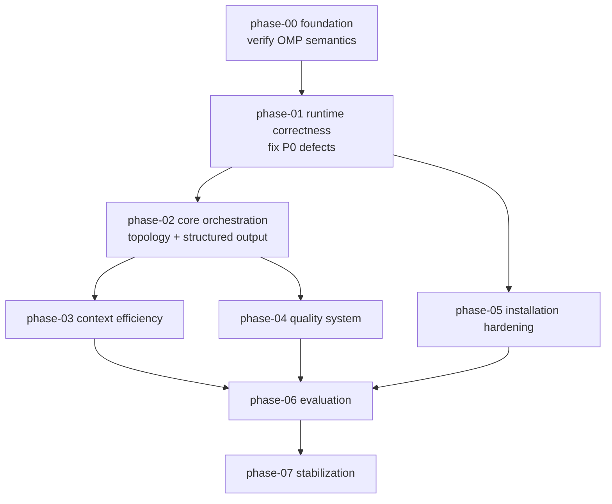

# OPUS PROPOSED SPEC v1 — omp-custom Architecture Review

<!-- topic08-projection:behavior-core -->
> **Topic 08:** `behavior-manifest.json` selects three current skills, with
> `evidence-before-completion` autoloaded only by Worker. The OMP adapter is
> `IMPLEMENTED_NOT_PROMOTED`; Claude is non-installable `DESIGNED_NOT_VERIFIED`. Explicit
> main-session `agent_tasks` bootstraps state, while generic mutation remains fail-closed.

<!-- topic05-projection:spec-index -->
> **KD-029:** progressive retrieval retains native `read`/`grep`/`glob` as the baseline and adds
> optional/default-off CodeGraph through a bounded worktree-local adapter. See `spec/07` for
> retrieval semantics, `spec/12` for installation, `spec/13` for evidence, and
> `docs/retrieval.md` for operations.

## Topic 04 selected durable authority

KD-028 selects local immutable JSON plus one deterministic PowerShell core. Git authority is
`<absolute-git-common-dir>/agent-tasks` (plural); non-Git authority is
`<project-root>/.agent-tasks`. One task owns one writer lease and one authoritative worktree;
separate mutating tasks use distinct worktrees/scope reservations. Candidate/evidence/handoff and
safe retention rules are projected in specs 01/02/04/05/08/10/12–16. Explicit manual use is
current; automatic lifecycle attachment remains Topic 08.

## Topic 06 selected managed boundary

KD-030 selects a trusted same-name OMP `task` wrapper over the native executor. The supported
entry point is `.omp/bin/omp-managed.ps1`; it validates a Topic 04 work-unit projection before
dispatch and a completed role result afterwards, then records only a provisional outcome. Bare
OMP, Vibe, `eval`, and unrelated internal-agent facilities are explicitly unmanaged.

Cheap Scout is Flash `xhigh` with Pro `xhigh` availability fallback, Worker is `high` or
Tech-Lead-selected `xhigh`, and Reviewer is `xhigh` with ARTIFACT + CONTRACT input and no Worker
CLAIM. Managed v1 rejects async/nested dispatch. Inline Tech Lead work is the normal fallback when
the boundary is unavailable and produces no fabricated receipt. Historical `.omp/schemas` files
are evidence only. `OPEN-T06-RUNTIME-01` is a nonblocking upstream universal-hook question.

## Topic 07 selected continuity boundary

KD-031 disables automatic semantic/context-promotion, idle, mid-turn, remote, and auto-continue
paths in managed sessions. After a Topic 04 task is armed, argument-free `/safe-compact` may run
one native local soft context-full transaction. It persists verified recovery bytes first,
settles one hash-bound kernel, and injects it once on the next normal prompt without hidden
continuation or retry. Pressure aborts ordinary provider dispatch; a bounded child fails rather
than compacting. Built-in `/compact`, direct `shake`, `snapcompact`, automatic handoff, bare OMP,
and remote compaction are outside the managed guarantee. The current status is
`IMPLEMENTED_NOT_PROMOTED` only because the required local OMP 17.2.10 canary is unavailable
(`OPEN-T07-RUNTIME-02`); installed 17.2.12 passes and Opus is not required.

> **Status:** Topic 03 topology/routing accepted in KD-027; remaining topics retain their own
> review and implementation status.
> Independent analysis by Claude Opus 5, verified against OMP source at
> `_research/upstreams/oh-my-pi` (packages/coding-agent). Subject to ChatGPT counter-review.

---

## 1. Executive Summary

`omp-custom` is a Workflow v0 template for OMP with a main-session Tech Lead and
runtime-specific adapters over OMP-native primitives. The earlier
Explorer→Implementer→Verifier→Reviewer chain is a pre-Topic-03 topology hypothesis, not a
workflow invariant.

KD-027 selects a main-session Tech Lead with default inline execution and exactly three
spawnable agents: read-only Cheap Scout, bounded-writing Worker, and risk-gated General Reviewer.
Worker defaults `high`, hard Worker and Reviewer use `xhigh`, Scout uses Flash→Pro availability
fallback, and Opus is never implicitly mandatory.

**The verdict: the intent is sound, the abstractions are ~60% correct, and the
runtime wiring is broken in ways static validation cannot see.**

The single most important finding is not any individual bug. It is a **category
error**: the template invented two folders (`.omp/policies/`, `.omp/schemas/`) and
two reference syntaxes (`policy:*`, `schema: \`name\``) that **do not exist in OMP**.
I grepped every discovery provider in OMP source. `commands/`, `skills/`, `agents/`,
`rules/`, `prompts/`, `hooks/`, `tools/`, `instructions/`, `extensions/` are
discovered. `policies/` and `schemas/` have **zero** discovery hooks. They are inert
files. Nine YAML documents totalling **581 lines** have no runtime consumer.

Meanwhile OMP **does** offer the exact primitive the template wanted: an `output:`
key in agent frontmatter, parsed into `ParsedAgentFields.output` and threaded to the
`yield` tool as an enforced schema with retry-on-mismatch. **None of the five agent
files use it.** The template hand-rolled a documentation convention where a native
enforcement mechanism was already available.

The second most important finding: `validate-template.ps1` asserts
`template\.omp\commands\quick.md` exists, while `install-template.ps1` maps its
`"workflows"` component to a `workflows/` folder that does not exist. **Validation
passes 63/63 and the installer silently installs zero command files.** This is the
clearest possible demonstration that the current 63/63 score measures file presence,
not correctness.

**Correction to my own first-pass reading:** I initially recorded that
`tech-lead.md` and `verifier.md` lacked `---` frontmatter fences. That was a
WebFetch HTML-rendering artifact. Byte-level inspection (`sed -n '1,8p' | cat -A`)
confirms **all five agent files have correct `---` fences**. That finding is
withdrawn. Similarly, `thinking-level:` and `read-summarize:` are **valid** — OMP's
`parseFrontmatter` runs `normalizeKeys`, which converts kebab-case to camelCase
before field parsing. Several items ChatGPT and I both flagged as "unverified
frontmatter" are in fact correct.

Worth preserving: the coding constitution in `AGENTS.md`, the four result contracts
(as *content*), the workflow-sizing decision signals, the context-budget policy's
numeric targets, and the false-positive-control discipline in `reviewer.md`. These
are genuinely good and mostly need re-homing, not rewriting.

---

## 2. Current System Maturity

| Dimension | Status | Evidence |
|---|---|---|
| Command discovery | ✅ Correct | `.omp/commands/*.md` → `discovery/builtin.ts:345` |
| Skill discovery | ✅ Correct | `.omp/skills/<name>/SKILL.md` → `discovery/builtin.ts:287` |
| Agent discovery | ✅ Correct | `.omp/agents/*.md` → `task/discovery.ts:80` |
| Agent frontmatter | ⚠️ Valid but incomplete | `name`/`description`/`tools`/`model`/`spawns`/`thinking-level`/`read-summarize` all parse; **`output:` unused** |
| `AGENTS.md` / `RULES.md` | ✅ Correct | `builtin.ts:923` / `builtin.ts:398` |
| `config.yml` | ✅ Discovered | `builtin.ts:879` |
| **`policies/`** | ❌ **Not an OMP concept** | Zero discovery hooks in any provider |
| **`schemas/`** | ❌ **Not an OMP concept** | Zero discovery hooks in any provider |
| Structured output enforcement | ❌ None | Native `output:` frontmatter + task `outputSchema` both unused |
| Agent topology | ⚠️ Ambiguous | `tech-lead.md` never spawned by any command |
| LSP wiring | ❌ Contradictory | `explorer.md` body says "use LSP hover, references"; `lsp` absent from its `tools:` |
| Installer | ❌ Broken | `"workflows"` → nonexistent folder; commands never install |
| Installer docs | ❌ Wrong args | README uses `-TargetDir`; script declares `-ProjectDir` |
| Config install | ❌ Clobbers | `Copy-Item -Force`, no merge |
| Benchmark | ❌ Inert | Prints fixture list and instructions; launches no session |
| Validation | ⚠️ Static only | File existence, char/4 token estimate, phrase grep |

---

## 3. Major Confirmed Problems

### P0 — blocks correct operation

1. **Installer never installs commands.** `install-template.ps1` default component
   list contains `"workflows"`, mapped to `template/.omp/workflows/`. The real folder
   is `commands/`. `Test-Path` fails, the loop contributes nothing, no warning is
   emitted. All three workflows are silently missing from every install.

2. **`policies/` and `schemas/` are inert.** Nine YAML files, no OMP consumer. Every
   `policy:workflow-sizing` and `` schema: `agent-result` `` reference in the agent
   prompts is an unresolvable string the model must guess at.

3. **Native structured output is unused.** OMP parses `output:` from agent
   frontmatter into `ParsedAgentFields.output`; `YieldTool` compiles it into a
   validator with up-to-3 retries on mismatch (`tools/yield.ts`,
   `MAX_SCHEMA_RETRIES = 3`). Zero agent files declare `output:`. The four schema
   YAMLs describe exactly what should go there.

4. **Documented install commands fail.** README and `docs/report-design.md` invoke
   `-TargetDir`; the script declares `-Target` + `-ProjectDir`. PowerShell rejects
   unknown named parameters, so the documented happy path errors out. `uninstall`
   docs pass `-TargetDir` while the script requires mandatory `-BackupDir`.

5. **Explorer instructs LSP use without LSP access.** `explorer.md` body: "Use LSP
   hover, references, and grep before reading full files." Its allowlist is
   `read, grep, glob`. Effective `lsp` access requires all four independent gates:
   allowlist membership (`task/executor.ts:2675-2678`), `task.enableLsp` plus a parent
   session that is not disabled and not in plan mode (`task/structured-subagent.ts:318-320`),
   and `lsp.enabled` (`tools/index.ts:593`). The instruction is unfollowable; the agent
   will either fabricate LSP calls or fall back to grep silently.

### P1 — blocks production use

6. `config.yml` install is `Copy-Item -Force` — destroys any pre-existing project config.
7. `$Force` parameter declared and never used; copies always force.
8. `task.isolation.mode=auto` selects a *backend*, not a *policy*. Per-task `isolated?: boolean` exists in the task schema and no command sets it.
9. `benchmark.ps1` measures nothing — no OMP invocation anywhere in the script.
10. `evidence-before-completion` is a lazily-triggered skill; it encodes a non-negotiable invariant.
11. `escalation.yml` has no reader — not referenced by any agent, command, or script.
12. `agent-result.schema.yml` is self-contradictory: `verification_results` is listed under `optional_fields` while a field rule requires it when `status: completed`.
13. `read-summarize: false` on Explorer and Verifier is valid syntax but works *against* the token goals — it disables OMP's read summarization for the two roles that read most.

---

## 4. Architecture Principles

1. **OMP is the only runtime.** No second orchestrator, scheduler, or worktree manager.
2. **OmniRoute is the only gateway.** All routing passes through it.
3. **Every artifact maps to a verified OMP primitive, or is explicitly labelled
   documentation / build input / dead.** No magic folders.
4. **Main session is the Tech Lead.** Commands carry the orchestration logic.
5. **Schemas live in `output:` frontmatter and task `outputSchema`.** YAML may remain
   as the human-authored source that *generates* those, never as a runtime lookup.
6. **Policy is prose in the prompt that consumes it.** A policy with no reader is dead.
7. **Isolation is explicit per task call.** Never rely on `auto` for correctness.
8. **Clear quality gates, then optimize core workflow tokens per validated accepted outcome.**
   Failed cycles stay charged; Scout/raw totals are telemetry, never weighted substitutes.
9. **A validator that cannot fail on a real defect is worse than no validator** — it
   manufactures false confidence.

---

## 5. Workflow and Lifecycle Architecture

A plain request is the normal workflow entry. The user may make an explicit `/quick`
selection; slash forms for Standard and Orchestrated remain compatibility hints. The
main-session Tech Lead validates entry hints and selects Standard or Orchestrated from the
task's actual structure.

```text
clarify contract
  → active task
  → freeze candidate
  → verify/review that snapshot
  → accept, rework, cancel, or terminally block
```

Standard is one integrated implementation lane. Orchestrated requires at least two
independently verifiable work units, explicit unit contracts, a task-level integration
contract, and cross-boundary verification. Agent count, parallelism, file count, and risk do
not define the workflow.

A session serves one task and one non-competing candidate lineage. Compaction preserves that
identity. Handoff creates a reconciled successor session. Mutation after candidate freeze
invalidates acceptance-bearing evidence for the old snapshot.

Topic 03 owns topology and model/provider routing, Topic 04 owns durable lifecycle state, and
Topic 08 owns deeper triage behavior. Runtime projection is scheduled in Phase 02; the
hash-locked Phase 00 prompt/evidence snapshot remains historical and unchanged until that
migration produces new current-product evidence.

**Pre-Topic-03 migration hypothesis:** move `tech-lead.md` out of agent discovery (CR-33).
OMP's `loadAgentsFromDir()`
parses **every** `.md` file under `.omp/agents/` (and `~/.omp/agent/agents/`) into an
active `AgentDefinition` — there is no "documentation-only file inside `agents/`"
category (`task/discovery.ts:42-45`). Calling the file documentation while installing
it as an agent would leave a second, mechanically spawnable Tech Lead path alongside
the main-session Tech Lead that DR-1 selected — reintroducing exactly the topology
ambiguity, divergent model/thinking routing, recursion cost, and final-answer
ownership confusion DR-1 resolved. The role contract is therefore re-homed to
`docs/roles/tech-lead.md`, outside every OMP discovery root, and is **not installed**.
See `03-agent-topology.md §A` and `phases/phase-01-runtime-correctness.md` T-01.8.

---

## 6. Phase Dependency Graph



---

## 7. Dependency Paths into Phase-06 — CR-15

There is no single "critical path" until task durations are estimated. The actual dependency edges that lead into P6 are:

- **P0 → P1 → P2 → P3 → P6**
- **P0 → P1 → P2 → P4 → P6**
- **P0 → P1 → P5 → P6**

P3 and P4 may begin after P2. P5 depends only on P1 and may run in parallel with P2/P3/P4 where resources permit.

Phase-00 is non-negotiably first: it converts remaining assumptions into observed behavior. Phase-01 clears the P0 defects. Phase-02 replaces the dead abstractions with native mechanisms and defines the integration procedure for parallel workers. Phase-06 is where any claim of improvement first becomes defensible — before it, all quality claims are assertions.

Note: P5 (installation hardening) depends only on P1, not P2. Stating all three of P3/P4/P5 as "after P2" would unnecessarily constrain P5 and contradict its independence.

**CR-15 resolution — single declared authority.** The `§6` Mermaid graph above is the
**canonical** phase DAG. The prose paths in this section and the `**Depends on**` /
`**Blocks**` headers in every `phases/phase-NN-*.md` file are **manually maintained
projections** of it — they are NOT generated, and no validator checks them. They MUST
NOT contradict the graph, but that "must" is a prose obligation, not a mechanism.
Both directions of every edge are stated: if `§6` has
`Px --> Py`, then `phase-Px` names `phase-Py` in `**Blocks**` **and** `phase-Py`
names `phase-Px` in `**Depends on**`. The nine canonical edges are:

| Edge | `**Blocks**` in | `**Depends on**` in |
|---|---|---|
| P0 → P1 | phase-00 | phase-01 |
| P1 → P2 | phase-01 | phase-02 |
| P1 → P5 | phase-01 | phase-05 |
| P2 → P3 | phase-02 | phase-03 |
| P2 → P4 | phase-02 | phase-04 |
| P3 → P6 | phase-03 | phase-06 |
| P4 → P6 | phase-04 | phase-06 |
| P5 → P6 | phase-05 | phase-06 |
| P6 → P7 | phase-06 | phase-07 |

Any edit to the graph must update both endpoints in the same commit. A one-sided
edge is a spec defect, not a stylistic choice.

**Current mechanical status (do not overstate this):**

```yaml
canonical_phase_dag: Mermaid §6
current_projection_method: manual
current_consistency: verified_by_hand_at_commit_c6f433a
automatic_validation: pending
CI_check: none                        # no .github/ in this repository
task_gate_derivation_from_phase_graph: not_implemented
```

The drift risk is demonstrated, not hypothetical: three reverse-endpoint declarations
(`P1 → P5`, `P3 → P6`, `P4 → P6`) were missing until a manual audit found them. Until a
deterministic validator exists — one that extracts the `§6` edges and diffs them against
every phase header in both directions, failing on one-sided or unknown edges — this
section is a convention, not a guarantee. Task-level gates (`**Blocks**` lines inside
phase files, e.g. T-00.E1…E5) are **outside** the phase-DAG authority and are not modeled
by this graph.

---

## 8. What Must NOT Be Implemented Yet

- Persistent memory, autolearn, automatic skill creation
- Always-on advisor; multi-reviewer panels
- Full OpenSpec / Spec Kit CLI
- Repo-map / semantic retrieval (Serena, repomix) — deferred pending evidence
- Second orchestration engine of any kind
- Automatic install into live `~/.omp/agent/` without explicit approval
- Settings changes outside an explicit phase-owned selected-contract prerequisite, or promotion
  of provisional settings before Phase 06 evaluation

Phase 01, Phase 03, and Phase 05 may implement settings they explicitly own as selected-contract
prerequisites. Those settings remain provisional candidates until Phase 06 evaluates them;
unowned or speculative settings changes remain frozen. This preserves evidence-gated promotion
without making the Phase 06 prerequisites depend circularly on Phase 06 itself.

---

## 9. Current Open Questions

Questions OQ-1, OQ-2, OQ-4 and the former model-role OQ-5 from my first pass are now
resolved by source reading or Phase-00 evidence. E2 closed the model-role question: missing
or unknown aliases and unavailable models hard-fail without fallback, project values win,
and configured built-in collisions use the configured value. What remains genuinely open —
requiring live experiment, not more reading:

| # | Question | Why source reading is insufficient | Impact |
|---|---|---|---|
| OQ-1 | Does `output:` frontmatter reliably enforce through OmniRoute's `openai-codex-responses` API? | `tryEnforceStrictSchema` falls back to `strict = false` per-provider; behavior with this specific gateway is empirical | High |
| OQ-2 | Does `task.isolation.mode=auto` on Windows/ProjFS actually isolate, and does `merge: patch` apply cleanly? | `pi-iso` backend selection is runtime/filesystem-dependent | High |
| OQ-3 | What is the real token delta of `read-summarize: false` on Explorer? | Requires measured A/B | Medium |
| OQ-4 | Does `autoloadSkills` inject into subagent context at spawn, and at what token cost? | Parsed field confirmed; injection point and cost need measurement | Medium |

---

## 10. Decisions Requiring ChatGPT Review

**CR-25 — Decision Record categorization:** DRs are split into two classes. *Runtime-fact-grounded* decisions are constrained by verified OMP source behavior — the opposite choice would be demonstrably wrong or require OMP changes. *Normative design choices* are well-supported judgment calls where a reasonable counterargument exists and peer review adds real value.

### A. Decisions Informed by Runtime Facts

**CR-25 — Epistemic separation:** Each decision below distinguishes what OMP source *proves* (a runtime fact, source-cited) from what was *chosen* (a normative decision, rationale-justified). Source evidence constrains the design space; it does not by itself determine the correct choice.

---

**DR-2 — Schema enforcement mechanism**

*Source facts:*
- OMP parses `output:` from agent frontmatter into `ParsedAgentFields.output` (`discovery/helpers.ts:289`)
- `YieldTool` compiles this into a validator with up to 3 retries on mismatch (`tools/yield.ts:MAX_SCHEMA_RETRIES=3`)
- Caller task `outputSchema` takes precedence over agent `output:` when present (`task/structured-subagent.ts:176-188`)
- Session-level `outputSchema` is a third source (lowest precedence)

*Design choice (normative):* Use agent `output:` frontmatter as the canonical schema source per agent. Treat caller `outputSchema` as an explicit per-call override only. Keep YAML under `docs/contracts/` as the human-authored generator source, not runtime files.

*Alternative rejected:* Inline `outputSchema` in every task dispatch. Rejected because: duplicates the source of truth, increases maintenance burden, and contradicts the agent-frontmatter-as-contract model.

---

**DR-3 — Fate of `.omp/policies/`**

*Source fact:* Zero discovery hooks for `policies/` in any OMP provider — exhaustive grep of all discovery providers confirms no loader exists.

*Design choice (normative):* Delete the folder; inline each policy as prose into its single consumer.

*Alternative not rejected (legitimate):* Move to `docs/` as human-readable reference without runtime claims. This is valid — the content is valuable. The chosen approach inlines it to (a) prevent `.omp/` placement from implying runtime meaning, and (b) eliminate synchronization risk between YAML and consuming prose. The spec author acknowledges reasonable peers could prefer `docs/` rehoming.

---

**DR-6 — Explorer isolation (pre-Topic-03 candidate)**

*Source facts:*
- `isolated: true` requires a git repository (`task/isolation-runner.ts: prepareIsolationContext` throws otherwise)
- Isolation materializes a worktree copy — real setup cost on every invocation
- Explorer only reads; it does not write to disk

*Candidate choice (non-authoritative until Topic 03):* Do not isolate a selected read-only
discovery role. A read-only role gains nothing from isolation; the git-repo requirement and
materialization cost add overhead with zero benefit. Topic 03 decides whether that role exists.

*Alternative not rejected (legitimate):* Isolate Explorer for strict reproducibility. Rejected on cost/benefit grounds, not because source proves it wrong.

---

**DR-7 — LSP in worker allowlists (pre-Topic-03 candidate)**

*Source facts:*
- Effective subagent LSP requires all four independent LSP gates: per-agent allowlist,
  `task.enableLsp == true`, parent session not disabled and not plan mode, and
  `lsp.enabled == true` (`task/structured-subagent.ts:318-320`, `tools/index.ts:593`,
  `task/executor.ts:2675-2678`)
- No agent currently lists `lsp` — the session-level permission is inert for all agents
- Explorer's own instructions reference `lsp references` and `lsp hover` — unfollowable with current allowlist

*Candidate choice (non-authoritative until Topic 03):* Give `lsp` only to selected roles whose
contracts require symbol navigation. The former Explorer/Implementer/Reviewer allowlist and
Verifier exclusion are retained as research input, not as a fixed roster or capability map.

*Alternative not rejected (legitimate):* Disable `task.enableLsp` and remove LSP language from Explorer. Rejected because LSP provides genuine token savings (targeted symbol lookup vs whole-file reads) that the Explorer's symbol-first contract depends on.

### B. Normative Design Choices

These positions are well-reasoned but involve trade-offs where a legitimate counter-position exists. ChatGPT review adds genuine value here.

**Topic 02 supersession boundary:** the source facts remain evidence, but all role-specific choices below are non-authoritative pre-Topic-03 migration hypotheses. Topic 03 re-adjudicates
the worker roster, capabilities, dispatch graph, and independence mechanism before Phase 02
changes runtime files.

| # | Decision | Opus Position | Confidence |
|---|---|---|---|
| DR-1 | Tech Lead: main session vs spawned agent | **Main session; main-session model is user-controlled (Option B, CR-06 resolved).** Spawning costs a recursion level, duplicates context, and orphans ownership of the final answer. The template does NOT guarantee `@tech-lead` routing or a fixed thinking level for the main Tech Lead session — those settings belong to the user's launched session. Role-based `model:` and `thinking-level:` frontmatter are deterministic only for spawned worker agents. `AGENTS.md` documents this contract explicitly. | High |
| DR-4 | `evidence-before-completion` delivery | **`autoloadSkills` on worker agents**, not `alwaysApply`, not lazy | Medium |
| DR-5 | `read-summarize: false` on observation roles | **Reopened by Topic 03.** Exact-output needs belong to the selected responsibility and capability contract, not to permanent Explorer/Verifier names. | Medium |
| DR-8 | Separate Verifier, inline verification, or another independent mechanism? | **Reopened by KD-026 and Topic 03.** When the accepted contract requires independent verification, a candidate author's self-report is insufficient; Topic 03 selects how a non-author supplies that evidence. | Medium |

---

## 11. Decisions Opus Is Highly Confident About

Each verified by direct source reading, with the file and line recorded in
`00-current-state-audit.md`:

- `policies/` and `schemas/` are not OMP concepts — exhaustive grep of all discovery providers
- Installer never installs commands — `"workflows"` alias vs `commands/` folder
- README/docs install args do not match script parameters — `-TargetDir` vs `-ProjectDir`
- `output:` frontmatter is the native schema mechanism and is unused — `discovery/helpers.ts:289`, `tools/yield.ts`
- Explorer's LSP instruction is unfollowable — its allowlist omits `lsp`; the other
  independent gates are projected by `task/structured-subagent.ts:318-320` and
  `tools/index.ts:593`
- `benchmark.ps1` executes no sessions — whole-script read
- `$Force` is dead — whole-script read
- `task.enableLsp` default is `false`; baseline overrides to `true` — `settings-schema.ts:4617`
- `task.isolation.mode` default is `none`; `auto` names a *backend* — `settings-schema.ts:4463`
- All five agent files have valid `---` fences and valid kebab-case keys — byte inspection + `normalizeKeys`

---

## 12. Decisions Opus Wants ChatGPT to Challenge

1. **DR-1 (topology).** I argue main-session-as-Tech-Lead. The strongest counter is
   that a spawned Tech Lead keeps the user-facing session context small on very long
   tasks. I think that trade is wrong — it moves final-answer ownership into a child
   whose result the parent must then re-summarize — but the context-growth concern is
   real and I want it pressure-tested.

2. **DR-3 (delete `policies/`).** ChatGPT may argue the YAML is valuable as
   human-readable documentation even without a runtime consumer. I agree the *content*
   is valuable and disagree that it should live in `.omp/`, where its presence implies
   runtime meaning it does not have. Challenge whether `docs/` re-homing loses anything.

3. **DR-4 (`autoloadSkills` vs `alwaysApply`).** This depends on OQ-4's measured cost.
   If injection is expensive, lazy triggering plus a one-line `RULES.md` invariant may
   dominate. I hold this at Medium confidence deliberately.

4. **My disagreement with ChatGPT's audit on items 11–12, 17.** ChatGPT flagged
   Explorer/Implementer "missing LSP" and "RULES too restrictive." On LSP I now find
   ChatGPT **more right than my own first pass** — I initially marked it NOT CONFIRMED
   and was wrong; the contradiction is real. On RULES.md I find ChatGPT **wrong** — the
   eight invariants are objective-risk constraints, not autonomy constraints, and
   should stay. I want ChatGPT to defend or withdraw item 17.

5. **Whether phase-00 is over-cautious.** I front-load an experiment phase before any
   fix. An argument exists that the P0 installer bugs are so clear-cut they should be
   fixed first. I chose evidence-first because three of my own first-pass findings were
   wrong; challenge whether that generalizes.

---

## 13. Expected Final Architecture After All Phases

- Every artifact maps to a source-verified OMP primitive, or lives outside `.omp/`
- Structured output enforced natively via `output:` frontmatter, validated at yield
- Policy content inlined into its consumers; `policies/` and `schemas/` gone from `.omp/`
- Responsibility-based isolation: concurrent writers are isolated only when selected; tasks
  that must observe the integrated tree remain non-isolated
- Logical model roles throughout; no hardcoded model IDs in agents or commands
- Installer with real merge, dry-run, diff, backup, manifest, idempotency, rollback
- Validation in five separable tiers; a single number can no longer imply all five
- Evaluation ladder L0–L3 operational, L4 A/B token-quality measurable
- Governance registry with pinned commits, watched paths, adoption ledger

---

## 14. Definition of "Production Ready"

These are the **canonical production-ready gates**, identified `PR-1`…`PR-8`. Every other
file MUST reference them **by ID** rather than restating them in prose (CR-23/CR-37).
Paraphrase is how "all four validation levels" and "every OQ resolved or explicitly open"
drifted into `phase-07` and contradicted this section; ID references cannot drift.

| ID | Gate |
|---|---|
| **PR-1** | All P0 and P1 findings in `00-current-state-audit.md` resolved, or explicitly waived with recorded rationale. |
| **PR-2** | **OQ-1…OQ-5 each `resolved_with_recorded_evidence`** — answered by recorded experiment, not inference. An OQ marked "explicitly open" does **not** satisfy this gate. |
| **PR-3** | Each of the three workflows executes end-to-end with no silent no-ops. |
| **PR-4** | Structured output demonstrably enforced: a deliberately malformed worker result is rejected and retried. |
| **PR-5** | Installer: dry-run, diff, backup, manifest, rollback, idempotent re-run, config merged not clobbered. |
| **PR-6** | Validation tiers report independently, and **L0–L3 operational gates are green**. No aggregate score conceals a tier failure. |
| **PR-7** | **L4 comparative contract in `13-validation-and-evaluation.md §C` clears:** every candidate promotion beats the frozen stable-product baseline through the efficiency or quality path; a release additionally clears the pinned plain-OMP comparison. Pilot-only evidence and `accepted_with_waiver` do not satisfy this gate. |
| **PR-8** | Every remaining abstraction has a named runtime consumer, or is documented as non-runtime. |

**Never state a validation-level count.** The taxonomy is **L0 Static, L1 Discovery,
L2 Contract, L3 Behavioral, L4 Adversarial/Comparative** — five levels, split across two
gates because they are gates of different kinds: PR-6 covers the four operational levels
that must be green, PR-7 covers the comparative benchmark that must meet a threshold.
Phrases like "all four validation levels passing" conflate them and are prohibited
(CR-23). See `13-validation-and-evaluation.md`.

**PR-2 is not waivable by a caveat (CR-37).** "Production ready with caveats X and Y" is a
legitimate verdict for known bounded limitations, but it cannot absorb an unresolved
High-impact runtime experiment. An open required OQ means a load-bearing runtime assumption
is unverified, which is exactly the class of unknown that a readiness claim asserts is
closed. If any required OQ is open, the verdict is **NOT READY** — with the specific OQ
named. Changing that policy requires changing this section, not a local exception in a
phase file.

---

## 15. Files Created Under spec/

```
spec/README.md                              ← this file
spec/00-current-state-audit.md
spec/01-target-architecture.md
spec/02-runtime-semantics.md
spec/03-agent-topology.md
spec/04-workflow-sizing.md
spec/05-context-and-token-model.md
spec/06-structured-output.md
spec/07-retrieval-and-code-understanding.md
spec/08-isolation-and-concurrency.md
spec/09-model-routing.md
spec/10-verification-and-review.md
spec/11-skills-rules-and-quality-gates.md
spec/12-installation-and-rollback.md
spec/13-validation-and-evaluation.md
spec/14-upgradeability-and-governance.md
spec/15-security-and-failure-recovery.md
spec/16-migration-plan.md
spec/phases/phase-00-foundation.md
spec/phases/phase-01-runtime-correctness.md
spec/phases/phase-02-core-orchestration.md
spec/phases/phase-03-context-efficiency.md
spec/phases/phase-04-quality-system.md
spec/phases/phase-05-installation-hardening.md
spec/phases/phase-06-evaluation.md
spec/phases/phase-07-stabilization.md
```

---

**CURRENT STATUS:** KD-027 through KD-031 are accepted implementation authority. Historical
review findings remain useful source evidence only where later decisions explicitly supersede
them. Topic readiness is established by the focused/current-product validators and evidence, not
by the original “OPUS PROPOSED” label.
